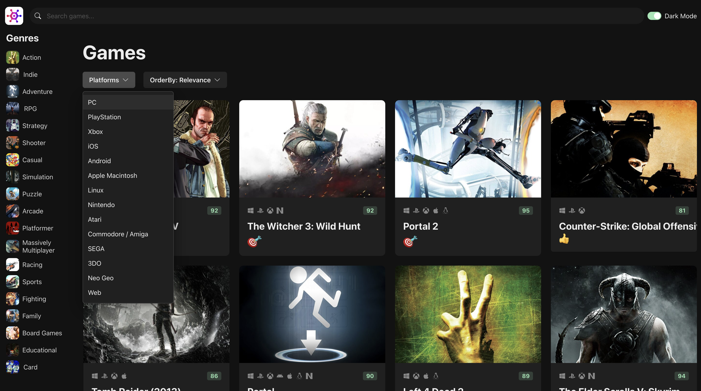

# GameHub

<table>
<tr>
<td>
GameHub is an information website that covers a wide range of games across various platforms. It provides users with a comprehensive database of games, allowing them to explore details about different games and watch their trailers. The project is built using React, incorporating several key features to enhance the user experience. It is inspired from rawg.io website, which has reach set of features.

Features:

1. Infinite Scrolling: The website implements infinite scrolling, allowing users to seamlessly browse through a large collection of games without the need for manual pagination. As the user scrolls down, new game entries are dynamically loaded, providing a smooth and uninterrupted browsing experience.

2. Filtering: GameHub offers robust filtering capabilities, enabling users to narrow down their search based on specific criteria such as genre, platform, release date, or popularity. This feature helps users find games that align with their preferences and interests more efficiently.

3. Routing: The project utilizes React Router to implement client-side routing. This enables users to navigate through different sections of the website seamlessly, ensuring a fast and responsive browsing experience. Users can access specific game details pages, search results, and other relevant sections without page reloads.

4. State Management: To efficiently manage the application's state, the project employs state management libraries such as Redux or React Context API. This allows for centralized state management, making it easier to handle data fetching, filtering, and maintaining the application's overall state consistency.

With these features in place, GameHub provides an immersive and user-friendly platform for game enthusiasts to discover, explore, and gather information about various games across different platforms. It aims to enhance the gaming experience by offering a centralized hub for game-related details and trailers.

</td>
</tr>
</table>

## Demo

Here is a working live demo : https://game-hub-delta-rust.vercel.app/

## Site

### Landing Page

### Sorting

### Platform Filter

### Single Game Info

## [Single Game Info](./src/assets/gameInfo.png)

### Games and Trailers

## [Single Game Info](./src/assets/gameHub-gameTrailer.gif)

### Built With

- [![React][React.js]][React-url]
- [![Chakra-ui][ChakraUI]][chakra-ui-url]

(<a href="#readme-top">back to top</a>)

<!-- MARKDOWN LINKS & IMAGES -->
<!-- https://www.markdownguide.org/basic-syntax/#reference-style-links -->

[React.js]: https://img.shields.io/badge/React-20232A?style=for-the-badge&logo=react&logoColor=61DAFB
[React-url]: https://reactjs.org/
[ChakraUI]: (https://img.shields.io/badge/chakra--ui-ui)
[Chakra-ui-url]: https://chakra-ui.com/
